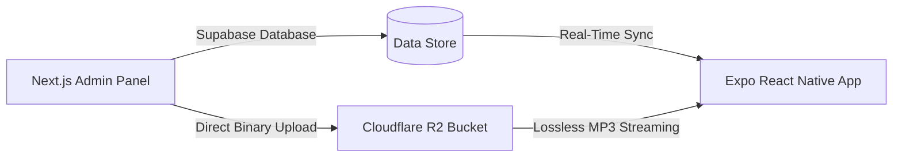

# Project Charter: MantraHilling (Jaybaba Enterprises)

## 🌐 Brand Positioning
Jaybaba Enterprises is NOT a local speaker rental company. It is a **PREMIUM EVENT EXPERIENCE BRAND** delivering state-of-the-art cinematic spectacles, acoustic sound therapies, and elite event productions.

The brand emotions express:
* **Apple-level Minimalism**
* **Tomorrowland Festival Energy**
* **Luxury Celebration Aesthetics**

---

## 🎯 Project Goal: MantraHilling
MantraHilling is a flagship hybrid acoustic sanctuary app that combines next-generation neurological binaural wave synthesis with premium Cloudflare R2 ambient audio streaming.

---

## 🛠️ Technology Stack
* **Web Admin Panel:** Next.js (App Router), Vanilla CSS (High-contrast obsidian), Supabase client, AWS S3 Client SDK
* **Mobile Client:** Expo React Native, HTML5 audio synthesis engine via WebView, LinearGradient glows, Native micro-animations
* **Backend Databases:** Supabase PostgreSQL (flat schema conditions directory, profile tables)
* **Audio Hosting:** Cloudflare R2 Storage (`hilling/music/` bucket prefix)

---

## 💎 Design System & Visual Grammar
* **Obsidian Foundations:** `#070707` · `#0B0B0B` · `#121212`
* **Accents:** Electric Blue `#00D1FF` · Neon Purple `#8B5CF6` · Luxury Gold `#F5B041`
* **Card Style:** Curved glassmorphism (`borderRadius: 22`), dynamic glowing border shadows matching target program accent colors, and tactile large paddings.
* **Typography:** Bold cinematic sans-serif titles with uppercase spaced tracking, poppins body text.
