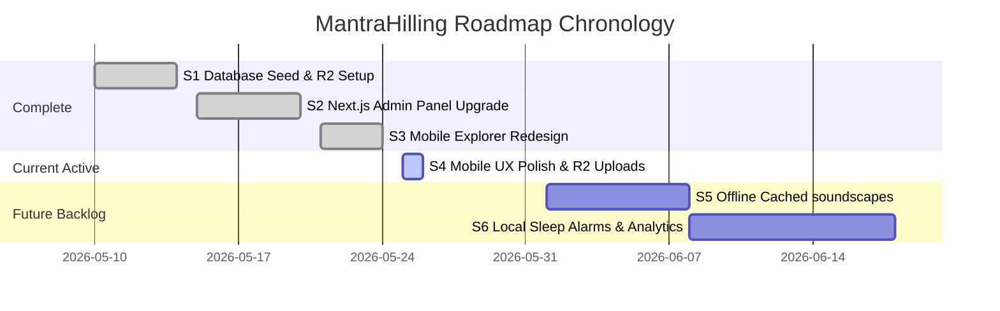

# Product Roadmap: MantraHilling

## 🏁 Milestones & Phase Progress

---

## 🌟 Milestone 1: Re-engineering Sanctuary & Dynamic Content Flows

### Phase 1: Storage & Database Integration (Completed)
* Integrated Supabase Flat Schema databases for condition programs and profile structures.
* Created Cloudflare R2 buckets for lossless audio file hosting.

### Phase 2: Web Admin Control Center Re-architecture (Completed)
* Implemented dynamic Category Sanctuary selector panels.
* Grouped sound target lists dynamically using CSS Grid responsive glassmorphic cards.
* Embedded S3 Client hooks for CORS-free server-side direct multipart uploads.

### Phase 3: Unified Mobile List Explorer (Completed)
* Refactored explorer pages in `App.js` into a unified, high-performance scrollable directory.
* Extracted Category Sanctuary details and mapped Sub-Categories dynamically with styled glassmorphic section dividers.

### Phase 4: High-Fidelity UX & Upload Fixing (Active / Completed)
* Upgraded tab navigation to a premium curved floating dock system.
* Polished header titles with high-contrast spaced tracking and background vagus glows.
* Added phase-level direct S3 audio uploads and auto-fetching URL bindings in `FrequencyEditor`.
* Fixed horizontal clipping and overlapping layout bugs in `FrequencyEditor` inputs.

---

## 🚀 Milestone 2: Future Expansion Backlog

### Phase 5: Offline Cached Ambient Soundscapes (999.1)
* Save and cache downloaded Cloudflare R2 ambient MP3 tracks locally inside the mobile file system to support seamless sound synthesis in offline flight modes.

### Phase 6: Sleep Alarms & Local Notifications (999.2)
* Allow users to set dedicated wake-up or bedtime sleep alarms that play acoustic solfeggio sequences directly on schedule.
